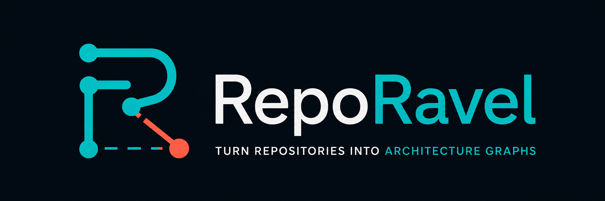

<p align="center">
  
</p>

<p align="center">
  <a href="https://github.com/12vault/ravel/actions/workflows/go.yml"></a>
  <a href="https://github.com/12vault/ravel/releases"></a>
  <a href="https://pkg.go.dev/github.com/12vault/ravel"></a>
  <a href="LICENSE"></a>
</p>

<p align="center">
  <strong>Secure, local code intelligence in a single Go binary.</strong>
</p>

Ravel turns code and documents into a local knowledge graph. Developers and coding agents can find the right files, trace relationships, and understand a system without scanning the repository from scratch.

**What you get:**

- One prebuilt binary with no Python runtime.
- Fast, offline analysis for Go and a broad set of Tree-sitter grammars.
- Evidence labels that separate parsed facts from inferred relationships.
- Audit-first scanning that excludes secrets, dependencies, and ignored files.
- Compact graph context for coding agents through the CLI or MCP.
- Optional agent enrichment for architecture, domains, flows, documents, and learning tours.

> [!IMPORTANT]
> Ravel keeps evidence levels separate. Parser facts are `extracted`, name-based matches are `inferred`, and unsafe matches remain unresolved. Optional agent enrichment is validated and provenance-tagged; it is never presented as parser output.

## Why Ravel?

Coding agents are good at reading a file. The harder problem is knowing which file matters, what calls it, and how it connects to the rest of the repository.

Ravel creates that missing map:

- Find entry points and central packages.
- Trace calls and definitions between symbols.
- Search the graph without rescanning source files.
- Generate a suggested reading order.
- Give coding agents compact, local repository context.
- Audit what will be read before building anything.

### Ravel and Graphify

[Graphify](https://github.com/safishamsi/graphify) aims for a broad knowledge-graph product with rich visualization, clustering, exports, and many integrations. Ravel has a narrower systems goal: provide secure, fast, deterministic code intelligence as a small, embeddable Go binary.

| Capability | Ravel | Graphify |
| --- | :---: | :---: |
| Prebuilt native binary | ✅ | — |
| No Python runtime | ✅ | — |
| Small compiled dependency surface | ✅ | — |
| Offline code analysis | ✅ | ✅ |
| No LLM required for code graphs | ✅ | ✅ |
| Polyglot Tree-sitter extraction | ✅ | ✅ |
| Deep Go AST and type analysis | ✅ | — |
| More language-specific extraction passes | ◐ | ✅ |
| Pre-build file audit | ✅ | — |
| Built-in secret and key-material exclusions | ✅ | — |
| Extracted, inferred, and unresolved evidence labels | ✅ | — |
| Embeddable Go packages | ✅ | — |
| Read-only MCP server | ✅ | ✅ |
| Self-contained HTML visualization | ✅ | ✅ |
| Automatic community clustering | ✅ | ✅ |
| Wiki and graph-database exports | — | ✅ |
| Optional semantic document enrichment | ✅ | ✅ |

**Legend:** ✅ built in · ◐ supported with less language-specific depth · — not a primary feature

Ravel does not try to win by having the longest feature list. It prioritizes a small attack and dependency surface, predictable local execution, explicit provenance, and release binaries that users can run without building the project or managing a language environment.

## Contents

- [Quick start](#quick-start)
- [Explore the graph](#explore-the-graph)
- [MCP server](#mcp-server)
- [Generated artifacts](#generated-artifacts)
- [Safety](#audit-first-safety)
- [Configuration](#configuration)
- [Agent workflow](#agent-workflow)
- [Integrations and hooks](#native-integrations-and-hooks)
- [Updating Ravel](#updating-ravel)
- [Capability layers](#capability-layers)
- [Benchmarks](#benchmarks)
- [Development](#development)
- [License](#license)

## Quick start

### Install a release binary

Install the latest checksum-verified release on macOS or Linux:

```sh
curl -fsSL https://raw.githubusercontent.com/12vault/ravel/main/install.sh | sh
```

The installer writes to `~/.local/bin` by default. If that directory is not on `PATH`, it prints the exact command to enable it. Run that command before using `ravel`, then add it to your shell profile so future terminals can find the binary.

On Windows PowerShell:

```powershell
irm https://raw.githubusercontent.com/12vault/ravel/main/install.ps1 | iex
```

PowerShell prints the equivalent `PATH` command when `~/.local/bin` is not already available.

Release archives also contain a portable `ravel` binary that runs in place without installation.

### Build from source

Install Go 1.26.5 or newer, then run:

```sh
git clone https://github.com/12vault/ravel.git
cd ravel
go install ./cmd/ravel
```

`go install` writes to `GOBIN`, or to `$(go env GOPATH)/bin` when `GOBIN` is unset. Make sure that directory is on `PATH`.

To build a portable binary in the current directory instead:

```sh
go build -o ravel ./cmd/ravel
```

### Connect a coding assistant

Install the project-local Codex skill directly from a source checkout:

```sh
go run ./cmd/ravel install --project --platform codex
```

Register the bundled skill with your AI coding assistant:

```sh
# Codex user-wide install
ravel install --platform codex

# Or keep the skill and integration files inside the current project
ravel install --project --platform codex
```

That command installs the complete skill bundle: orchestration instructions, seven role prompts, references, and launchers. Marketplace packages also include native Ravel binaries for macOS, Linux, and Windows on amd64 and arm64. If `ravel` is not already on `PATH`, the skill uses the matching bundled binary in place, with no initial download or separate installation.

Then invoke the skill in Codex:

```text
$ravel .
```

Assistants that use slash commands accept `/ravel .` instead. The installer also supports `claude`, `codebuddy`, `opencode`, `kilo`, `copilot`, `vscode`, `aider`, `openclaw`, `droid`, `trae`, `trae-cn`, `gemini`, `hermes`, `kimi`, `amp`, `agents`, `kiro`, `pi`, `cursor`, `devin`, and `antigravity` skill locations. Use `--project` for a repository-scoped installation.

### Build your first graph

Run these commands from the repository you want to analyze:

```sh
cd your-repository

# Confirm the installed version.
ravel version

# Preview which files Ravel will read.
ravel audit .

# Build the local graph in .reporavel/.
ravel build .

# Print the generated overview.
ravel report

# Generate a self-contained interactive graph.
ravel dashboard
```

## Explore the graph

### Search and retrieve context

Search for files, packages, types, functions, or methods:

```sh
ravel query "SessionManager"
```

Retrieve a connected, token-bounded explanation for a natural-language question:

```sh
ravel context "how does SessionManager create and persist a session?"
```

`ravel context` combines Unicode-aware BM25F/IDF ranking, multiple lexical seeds, and deterministic graph traversal. It defaults to bidirectional BFS at depth 2, suppresses expansion through non-seed super-hubs, and keeps every discovered node beside the edge that explains why it was included. The compact text payload is conservatively bounded to about 2,000 tokens by default.

Useful controls include:

```sh
ravel context --traversal dfs --direction out --max-depth 3 "authentication flow"
ravel context --relations calls,references --token-budget 1200 "who reaches CreateSession?"
ravel context --branch-fanout 32 "wide dispatcher dependencies"
ravel context --json "what imports the storage package?"
```

When no explicit `--relations` filter is supplied, Ravel can infer one from words such as “called,” “imports,” “inherits,” or “tested.” Use `--infer-relations=false` to traverse every available relationship. `--json` returns the same selected context in a machine-readable envelope; `estimatedTokens` measures the compact text payload, so JSON field-name and formatting overhead is intentionally not included.

Compact output reports every truncation cause. `token_budget` can be addressed by raising `--token-budget` or narrowing the output. `branch_limit` happens earlier during traversal: narrow relations/depth or raise `--branch-fanout`; more output tokens alone cannot recover a pruned branch. The default branch fanout of `0` chooses a safe automatic cap from the node, seed, and depth limits.

### Trace relationships

Explain a file or symbol and show its immediate relationships:

```sh
ravel explain "internal/auth/session.go"
```

Find a path between two graph nodes:

```sh
ravel path "main" "CreateSession"
```

`path` prefers a directed route. If only graph connectivity exists, the result is labeled `undirected_fallback`, and every hop reports whether it was followed forward or in reverse together with the original edge orientation. Duplicate exact target names for `affected`, `explain`, or `path` are ambiguity errors that list candidate node IDs instead of choosing silently.

Find incoming callers, references, implementers, importers, and other dependents of one target:

```sh
ravel affected "CreateSession"
```

`affected` defaults to reverse dependency relationships, excluding generic containment noise; explicitly requested `affects` or `flows_to` edges follow their forward causal orientation. A file target bootstraps its direct definitions. A package, module, or directory target bootstraps directly contained files and their direct definitions, with at most 20 total origins. It intentionally does not recurse through an entire repository or nested directory tree; use changed-file inputs or `ravel diff` for repository-wide impact. Use `--relations` to narrow traversal further; a target that cannot be resolved is reported as an error rather than guessed.

Add `--json` to `query`, `explain`, or `path` when another tool will consume the result.

Natural-language wording is accepted for compact lexical graph search:

```sh
ravel query "which parts handle authentication?"
```

Use `query` when a short ranked list is enough. Use `context` when the relationships around the matches are part of the answer.

### Run focused workflows

Focused graph workflows are first-class commands:

```sh
ravel tech
ravel understand
ravel learn
ravel docs
ravel pdf
ravel schema
ravel diff                 # impact from the last update
ravel diff internal/api.go # impact from explicit paths
```

In an agent session, these routes also activate the specialized semantic roles and merge their evidence-tagged fragments.

## MCP server

Expose the existing graph to MCP-capable coding agents without a network service or additional dependencies:

```sh
ravel mcp --out .reporavel
```

The stdio server provides five read-only tools: `query`, `context`, `explain`, `path`, and `affected`. `context` keeps Ravel's normal traversal, hub-suppression, confidence, evidence, and token-budget controls. `affected` uses reverse dependency traversal by default, excluding generic containment noise; explicitly requested causal edges follow their forward orientation.

Configure a client to launch the local process with `ravel` as the command and `mcp --out /absolute/path/to/.reporavel` as its arguments. The server supports standard newline-delimited MCP stdio and Content-Length framing, locks to the client's first framing mode, and writes protocol messages only to stdout. It keeps one immutable in-memory index and hot-reloads it after an atomic graph-state replacement, so `ravel update` results become available without restarting the client.

## Generated artifacts

`ravel build .` writes these files to `.reporavel/` by default:

| File | Purpose |
| --- | --- |
| `report.md` | Human-readable architecture summary and reading order |
| `graph.json` | Complete node, edge, metric, and diagnostic graph |
| `files.json` | Scanned files, hashes, sizes, languages, and ignored paths |
| `symbols.json` | Extracted functions, methods, types, variables, and related symbols |

Ravel also keeps canonical update state under `.reporavel/.state/`. Disabling JSON output removes the public JSON exports but preserves this internal state so updates and queries continue to work.

`ravel dashboard` additionally creates `graph.html`, a dependency-free local dashboard with search, kind filters, node details, relationship navigation, and automatic community grouping. Ravel assigns stable community IDs from graph structure, stores them in node metadata, and uses them to group and color related nodes without changing query behavior.

Create a reviewable team bundle that omits raw source and private scanner state:

```sh
ravel share --out ravel-graph
git add ravel-graph
```

The bundle contains `graph.json`, `report.md`, `graph.html`, and a safety manifest. Review inferred content before committing it.

The graph models repository containment, code symbols, documents, schema entities, technical architecture, and business domains. The Go parser, pure-Go Tree-sitter polyglot parser, Markdown parser, and SQL parser add deterministic facts; SQL facts include tables, views, columns, indexes, declared foreign keys, and conservative `FROM`/`JOIN` references. Tree-sitter parses are bounded to two seconds per file, recoverable syntax errors are reported as diagnostics, and stopped partial parses are never emitted as complete facts. Agent-produced facts for any language or corpus enter through validated, provenance-tagged graph fragments:

```sh
ravel ingest fragment.json
```

## Audit-first safety

Ravel is local-first and audit-first.

See [`SECURITY.md`](SECURITY.md) for supported versions, private vulnerability
reporting, the threat model, and CI security controls.

- `ravel audit .` lists what will be analyzed and ignored.
- Analysis, graph, query, dashboard, and corpus commands make no network requests and never call an LLM. Only the explicit `ravel update-check` and `ravel self-update` commands access the release server.
- `ravel extract` may execute a discovered, allowlisted local extractor (`pdftotext`, `mutool`, or `pandoc`) only when the user invokes that command.
- Agent roles run only through the installed skill and the host assistant's normal permission model.
- `.gitignore` rules, symlinks, `.env` files, private-key formats, credential directories, databases, archives, binary media, dependency folders, and common build output are rejected before file content is read.
- Default limits are 1 MiB per file and 100 MiB total input.
- Output goes to `.reporavel/` unless another directory is explicitly selected.
- Unresolved calls stay unresolved instead of being presented as certain matches.

Check the active defaults at any time:

```sh
ravel doctor
```

These defaults reduce accidental exposure; they are not a substitute for reviewing what exists in a repository before processing or sharing generated artifacts.

## Configuration

Create `.reporavel.yaml` with documented defaults:

```sh
ravel init
```

Useful command-line overrides include:

```sh
ravel audit --max-file-size 2097152 .
ravel build --out /tmp/ravel-output .
ravel build --no-call-graph .
ravel update .
```

Configuration is strict: unknown settings, invalid values, and options that are not implemented yet return an error. Set `analysis.go` to `false` to disable Go semantics and `analysis.polyglot` to `false` to disable Tree-sitter semantics. Disable both, plus `analysis.documents` and `analysis.schemas`, for topology-only output. The `output.json` and `output.markdownReport` switches control which artifacts are written.

### Supported languages

Packaged binaries embed a curated, self-contained grammar set for JavaScript/TypeScript/TSX, Swift, Python, Java, Kotlin, Scala, Rust, Ruby, PHP, C/C++, C#, F#, Dart, Elixir, Erlang, Clojure, Lua, R, Objective-C, Perl, Groovy, Solidity, shell, PowerShell, HCL, Protocol Buffers, and GraphQL. Source builds without release tags embed gotreesitter's complete registry. Grammar loading is lazy in both cases; Ravel only emits semantics when a grammar provides a compilable structural tags query.

### Retrieval defaults

The connected retriever can also be configured once for agents and benchmarks:

```yaml
retrieval:
  traversal: bfs
  direction: both
  inferRelations: true
  relations: all
  seedLimit: 3
  maxDepth: 2
  maxNodes: 100
  branchFanout: 0 # automatic; positive values override neighbors expanded per node
  hubDegreeThreshold: 0 # automatic p99 with a floor of 50; -1 disables
  tokenBudget: 2000
```

## Agent workflow

The repository includes [`skills/ravel/skill.md`](skills/ravel/skill.md), a progressive agent workflow for technical maps, architecture understanding, business domains, change impact, documents, PDFs, schemas, articles, and dependency-ordered learning tours. Installers and marketplace packages publish it as the required uppercase `SKILL.md`.

The intended loop is:

1. Audit the repository or corpus.
2. Build deterministic graph facts with user consent.
3. Run `ravel plan <route> --json` to create bounded, dependency-aware agent tasks.
4. Dispatch the seven packaged agents in ready waves and validate every returned fragment with `ravel ingest`.
5. Use `context` for bounded relationship questions, `query` for exact lookups, and `explain`, `path`, and `dashboard` for focused exploration.

Use `ravel tools` before document, PDF, or schema work. It discovers local extractors and database clients without executing them. `ravel extract <audited-file>` then processes PDF, DOCX, ODT, RTF, Markdown, or text locally into `.reporavel/corpus/`; it refuses unaudited paths. PDF content stays local unless the user separately authorizes an external service.

## Native integrations and hooks

Project installs place the portable skill in the platform's native directory. For Codex, Claude Code, Cursor, VS Code/Copilot, Gemini CLI, and OpenCode, Ravel also installs owned project instructions, rules, or hooks. Existing configuration is preserved, repeated installs are idempotent, and uninstall removes only Ravel-owned content.

Manage a native integration directly:

```sh
ravel codex install
ravel codex uninstall
ravel claude install
ravel cursor install
ravel vscode install
ravel gemini install
ravel opencode install
```

The Claude marketplace package lives in [`.claude-plugin/marketplace.json`](.claude-plugin/marketplace.json), and the Codex marketplace package lives in [`.agents/plugins/marketplace.json`](.agents/plugins/marketplace.json). Both packages are validator-clean. The direct CLI installer remains available for every supported assistant destination.

Automatic graph refresh is opt-in. Install Git `post-commit` and `post-checkout` hooks from the repository:

```sh
ravel hook install
ravel hook status
ravel hook uninstall
```

The Git hooks launch `ravel update .` in the background and write failures to the temporary `ravel-hook.log` file. Existing hook content is preserved.

For live work without Git events, use polling watch mode:

```sh
ravel watch --interval 2s .
```

Only changed hashes trigger an update. The update invalidates stale agent enrichment and records changed paths for `ravel diff`.

The installed Ravel skill runs one local, hash-aware `ravel update .` at the beginning of a task whenever an existing `.reporavel/graph.json` is present. Missing graphs still require an audited, consented first build. The skill never starts watch mode, installs Git hooks, or leaves a background process running without explicit consent.

## Updating Ravel

Check for a newer release without downloading or changing anything:

```sh
ravel update-check
ravel update-check --json
```

`update-check` makes one explicit release-metadata request. Ravel does not check for updates in the background and never updates itself during a skill tool call.

Binary and manual skill installations can then update together:

```sh
ravel self-update --platforms codex,claude
ravel self-update --platforms codex,claude --project
```

The command downloads the selected release archive and checksum, verifies it, atomically replaces the binary, then refreshes only the explicitly listed skill destinations. Marketplace-managed skills update through their marketplace client.

Installed Ravel skills perform a zero-network local version handshake on their first invocation. Their launcher compares the global CLI with the skill's `VERSION`; when the global CLI is older, it uses the bundled binary and prints a non-blocking update hint. It does not run `update-check` or `self-update` automatically.

After CLI changes, run `python3 scripts/sync-packages.py` to rebuild all six native binaries and copy the refreshed skill bundle into both marketplace packages. Validate the result with `python3 scripts/test_release.py`.

macOS release jobs use `MACOS_CERTIFICATE_P12`, `MACOS_CERTIFICATE_PASSWORD`, `MACOS_SIGNING_IDENTITY`, `APPLE_ID`, `APPLE_APP_PASSWORD`, and `APPLE_TEAM_ID` repository secrets when available. Until those are configured, releases use ad-hoc signatures for integrity but are not notarized by Apple.

Maintainers prepare a synchronized release with `scripts/release.sh 0.2.0`. It updates CLI, Claude, and Codex versions, rebuilds the bundled binaries, synchronizes every packaged skill resource, runs tests and validators, and verifies that no package drift remains. Committing and pushing tag `v0.2.0` triggers the binary release workflow.

## Roadmap

- Configure Apple Developer ID signing and notarization secrets for Gatekeeper-approved macOS marketplace and release binaries.
- Replace ad-hoc macOS release signatures with mandatory Developer ID signatures after the first public MVP releases.

## Capability layers

| Capability | Offline Go binary | Agent skill |
| --- | --- | --- |
| Popular languages | Safe file topology plus pure-Go Tree-sitter semantics for the packaged grammar set | Architecture, intent, and explanations across languages |
| Code structure | Go AST plus extracted Tree-sitter definitions/call sites; inferred target matching is labeled | Language-independent specialized code analyzer |
| Docs and schemas | Markdown headings/links; SQL tables, views, columns, indexes, foreign keys, and `FROM`/`JOIN` references | Rich document, PDF, article, and schema semantics |
| Domains and flows | Validated graph model and focused views | Domain, flow, process-step, and actor inference |
| Learning | Centrality and tour graph views | Generated onboarding guides and dependency-ordered tours |
| Queries | IDF/BM25F search, bounded multi-seed BFS/DFS context, explain, shortest path, traversal, impact | Natural-language synthesis grounded in graph evidence |
| Updates | Hash-aware update, Git hooks, and watch mode | Stale enrichment invalidation and targeted re-analysis |
| Dashboard | Self-contained read-only HTML | Optional generated explanations and tours |

The distinction is intentional: a skill does not need a language allowlist, but users still need to know which facts are reproducibly parsed and which are inferred by an agent.

## Benchmarks

Run the local build/query performance suite with `./benchmarks/run.sh`. Run the checked-in relationship suite with `ravel benchmark --dataset benchmarks/ravel-retrieval.jsonl --retriever context`; use `--retriever flat` for the ranked-list baseline. [`benchmarks/datasets.json`](benchmarks/datasets.json) defines the implemented repository-question contract. Version 3 reports node recall/precision, evidence recall/precision, reciprocal rank, p50/p95 latency, compact context tokens, node and evidence recall per 1,000 tokens, truncation rate, index-build time, logical graph and dataset hashes/revisions, adapter version, Ravel version, Go version, and platform. An optional strict `--answers` ledger adds externally adjudicated accuracy, rubric key-fact coverage, total agent tokens, total spend, and provenance without retaining raw answers; see the [benchmark guide](benchmarks/README.md). Ravel does not claim native LOCOMO/LongMemEval corpus adapters and never invokes a model or judge. Every published score must retain the raw result file and configuration.

## Development

Run the checks:

```sh
go test ./...
go vet ./...
```

The test fixture under `testdata/simple-go-service/` covers repository topology and Go call extraction.

## License

Ravel is available under the [MIT License](LICENSE).
