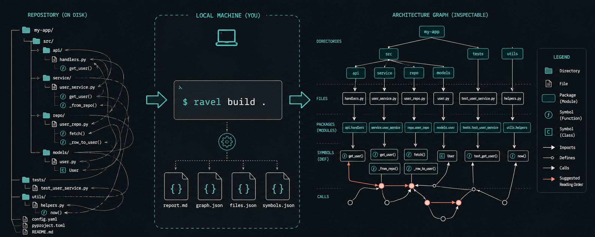

# RepoRavel



**Untangle your codebase.**

RepoRavel builds a local graph of a repository so developers and coding agents can understand its shape before reading files one by one.

It maps directories, files, packages, symbols, imports, definitions, and calls into inspectable JSON artifacts and a concise Markdown report. Everything runs locally: no network requests, hosted service, embeddings, or language model required.

> [!NOTE]
> RepoRavel is an early v0.1 project. Go has AST-level symbol and call analysis today. Other recognized file types appear in the repository topology but do not yet receive semantic analysis.

## Why RepoRavel?

Coding agents are good at reading a file. The harder problem is knowing which file matters, what calls it, and how it connects to the rest of the repository.

RepoRavel creates that missing map:

- Find entry points and central packages.
- Trace calls and definitions between symbols.
- Search the graph without rescanning source files.
- Generate a suggested reading order.
- Give coding agents compact, local repository context.
- Audit what will be read before building anything.

## Quick start

RepoRavel requires Go 1.26.5 or newer.

Install the CLI from a clone:

```sh
git clone https://github.com/12vault/ravel.git
cd ravel
go install ./cmd/reporavel
```

Then run it from a repository:

```sh
cd your-repository

# Preview which files RepoRavel will read.
reporavel audit .

# Build the local graph in .reporavel/.
reporavel build .

# Print the generated overview.
reporavel report
```

Or build a local binary:

```sh
go build -o reporavel ./cmd/reporavel
```

## Explore the graph

Search for files, packages, types, functions, or methods:

```sh
reporavel query "SessionManager"
```

Explain a file or symbol and show its immediate relationships:

```sh
reporavel explain "internal/auth/session.go"
```

Find a path between two graph nodes:

```sh
reporavel path "main" "CreateSession"
```

Add `--json` to `query`, `explain`, or `path` when another tool will consume the result.

## Generated artifacts

`reporavel build .` writes these files to `.reporavel/` by default:

| File | Purpose |
| --- | --- |
| `report.md` | Human-readable architecture summary and reading order |
| `graph.json` | Complete node, edge, metric, and diagnostic graph |
| `files.json` | Scanned files, hashes, sizes, languages, and ignored paths |
| `symbols.json` | Extracted functions, methods, types, variables, and related symbols |

The graph models repository containment plus Go packages, imports, definitions, and resolved or unresolved calls.

## Audit-first safety

RepoRavel is deliberately small and local.

- `reporavel audit .` lists what will be analyzed and ignored.
- Network access, shell execution, LLM calls, and subagents are not used.
- `.env` files, private-key formats, databases, archives, binary media, dependency folders, and common build output are ignored by default.
- Default limits are 1 MiB per file and 100 MiB total input.
- Output goes to `.reporavel/` unless another directory is explicitly selected.
- Unresolved calls stay unresolved instead of being presented as certain matches.

Check the active defaults at any time:

```sh
reporavel doctor
```

These defaults reduce accidental exposure; they are not a substitute for reviewing what exists in a repository before processing or sharing generated artifacts.

## Configuration

Create `.reporavel.yaml` with documented defaults:

```sh
reporavel init
```

Useful command-line overrides include:

```sh
reporavel audit --max-file-size 2097152 .
reporavel build --out /tmp/reporavel-output .
reporavel build --no-call-graph .
```

Configuration is strict: unknown settings, invalid values, and options that are not implemented yet return an error. Set `analysis.go` to `false` for topology-only output. The `output.json` and `output.markdownReport` switches control which artifacts are written.

## Agent workflow

The repository includes [`skills/reporavel/skill.md`](skills/reporavel/skill.md), a small agent workflow that prefers generated graph evidence before broad source reads.

The intended loop is:

1. Audit the repository.
2. Build the graph with user consent.
3. Read `.reporavel/report.md`.
4. Use `query`, `explain`, and `path` for focused questions.
5. Open source files only when graph evidence is not enough.

## Current scope

RepoRavel currently provides:

- Cross-language file and directory topology.
- Go package, import, function, method, type, variable, and call extraction.
- Search, relationship explanations, and shortest-path queries.
- JSON output for tools and Markdown output for humans.
- Deterministic artifact ordering for reviewable results.

Not implemented yet:

- Semantic analyzers for languages other than Go.
- Full Go type resolution across every call form.
- Incremental rebuilds or watch mode.
- An MCP server or editor integration.
- A production SQLite index.

## Development

Run the checks:

```sh
go test ./...
go vet ./...
```

The test fixture under `testdata/simple-go-service/` covers repository topology and Go call extraction.

## License

RepoRavel is available under the [MIT License](LICENSE).
